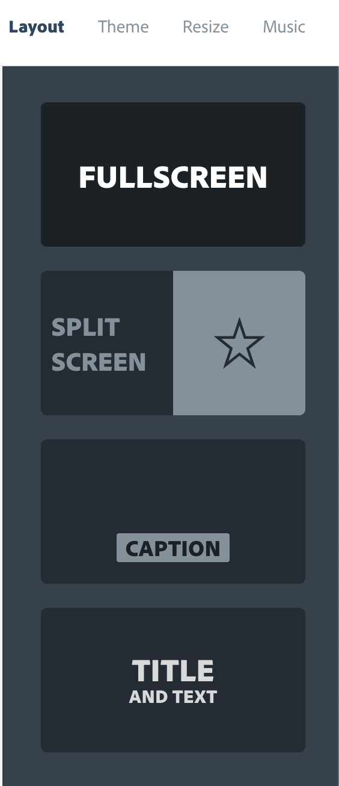

# Project presentation video

# Leader notes

## Overview

This activity fulfills Stage 3, Requirement 4 of the Digital Maker Staged Activity Badge (show and present your digital making project).

Young people will create a video presentation of their project. They may also, optionally, publish that presentation online or as part of a website they have created.

## Information 

+ Time - 60 minutes 
+ Group size - Flexible (2–4 young people)
+ Preparation needed - Ensure you have WiFi for the editing stage
+ Location - Filming can take place anywhere you have the young people's projects available. Editing should occur wherever you have access to computers.

## You will need

+ Video capable cameras. Smartphones are perfect for this.
+ Laptops or desktop computers
+ These can be shared between the group, recommend 1 per group
+ Activity handouts
+ Blank paper and pens/pencils/markers for storyboarding
+ WiFi access for the editing stage

## Key messages

+ The value of clear and engaging communications
+ What we learn from creating teachnology can be about more than technology

## Leader instructions
1. Discuss what the young people have already achieved by creating their proejcts.
2. Explain how sharing what we have learned with the wider group helps us learn from each other.
3. Explain that they will be creating videos to demonstrate the projects they have already created, as well as what they learned in the process of creating those projects. 
4. Mention that our greatest learning tends to come from times when we struggle and make mistakes, so they should not worry about discussing dificulties they encountered during the proejct, how they overcame them, or even how they plan to work to overcome them in the future.

## Alternatives

+ An in-person presentation can also fulfil this badge requirement and that the storyboarding and scripting steps can be used to prepare such a presentation.

## Safety

If the young people are working online, tell them to ask for permission before viewing any other websites. It’s a good idea to set up parental controls — you can find instructions for this on the NSPCC website [rpf.io/scouts-nspcc-online](http://rpf.io/scouts-nspcc-online).

You should also give each young person a Stay Safe leaflet [rpf.io/scouts-staysafe](http://rpf.io/scouts-staysafe).

Before young people publish any video check to ensure that:

  + They cannot be identified from any material in the video
  + They have not included identifying information (like their full names) along with the video
  + Any adult participants in the video have consented to being filmed and included in the published video.

You should also consider whether you want information that could identify your troop in any videos published online.

Make sure that young people don’t attempt any shots that are potentially dangerous to film. Stunts and pyrotechnics, for example, are probably best avoided!

## Account registration

Young people will need an Adobe Spark account to complete this project. One option to consider would be creating a shared account for the troop, or for each group, that you have access to.

If participants are over 13 they can create their own Adobe accounts and use those to edit their videos instead.

# Project presentation video

# Handout

In this activity you’ll be creating a video to explain and demonstrate the digital making project you have already completed. 

## Instructions

### Part 1 — Storyboard your video

[[ART : SHORT (3 FRAME) EXAMPLE STORYBOARD — SHOULD LOOK LIKE A SKETCH TO SOME DEGREE]]

Before starting to record your video it’s a good idea to plan everything out. Think about which aspects of your project you want to focus on and draw some rough sketches of the different shots that you will need to discuss those aspects. Consider including some of the following:

#### A technical demo
Show viewers how the project works. Take them through the process of using the project in the situation it’s designed to help with, showing them how it works and how it improves the situation. You might also add a voice-over later, in editing.

#### What was different, or interesting
When talking about how you created your project, consider the things that may make your project different from what your audience might have already seen: did you try to solve an unusual problem? Use a new or cool technology?

#### Your biggest lesson from the project
The biggest lesson you learned from the project. This may be related to the biggest challenge you faced. Remember that this might not have been a lesson about technology!

#### Keep in mind: Online safety
If you are planning to share your video online, make sure that none of your shots include the faces or names of anyone under the age of eighteen, and that you have permission from any adults you film to include them in your video. It is safe to use images that can’t be identified, like your hands using the project you’re demonstrating, the back of someone’s head, or your voice as narration over the video.

### Part 2 — Write a script

Once you’ve decided on your shots, decide who will say what and write a script for each shot. The script helps ensure that you don’t leave anything out while filming that you will later need when editing your video together. It also means that if you film multiple takes of the same shot, you’ll be able to use pieces from different takes if you need to.

### Part 3 — Shooting video

Creating a good shot with a camera is about more than just picking the right thing to point it at. Here are a few things you might want to consider:

#### Holding a smartphone
It's a simple thing, but holding a smartphone horizontally when shooting can produce a much more professional looking result.

#### Backgrounds
Don’t just watch the focus of your shot. Make sure to keep an eye on everything in the picture, particularly in the background, to avoid problems like trees that seem to be growing out of people’s heads!

[[ART POTENTIAL FUN IMAGE HERE]]

#### Lighting
The most important thing you need to make a good video is the right kind of lighting. Daylight is usually the best light you can get but sometimes you might want to use a different kind of light to achieve a particular effect. Remember to check how the camera is recording the image — your eyes are much better at reacting to unusual lighting conditions than even the best cameras.

#### Camera angle
Consider things like pointing the camera up at a subject to make it look large and impressive, or down to achieve the opposite effect. Don't be afraid to get inventive!

#### The rule of thirds
Another thing to consider is where in the shot you put the most important elements — the eyes of a person you’re interviewing, or the component you’re talking about if you’re looking at an electronics project. 

A good rule to follow here is the rule of thirds: imagine a three-by-three grid over your shot and place the important elements at the points where the lines on those grids meet.

[[ART IMAGE OF RULE OF THIRDS GRID OVER A SHOT OF SOMETHING… PROBABLY A PERSON]]

### Part 4 — Getting video into the editor

#### Transferring video to a computer
Move the footage you’ve recorded on your phone, or camera, to your computer. Depending on what you’re using, this might be by putting it on an SD card and inserting it in your computer, sending it attached to an email, putting it into a Google (on an Android device) or Apple (on an iOS device) account, etc.

#### Uploading video to Adobe Spark
Once you’ve got the video on your computer you’ll need to move it into a video editor. We’re going to use Adobe Spark, as it’s free and can be used in your browser.

1. Go to [spark.adobe.com](https://spark.adobe.com) and create an account by clicking on the ‘Get started now button’. You can either make an account by clicking ‘Sign up with email’ or sign-in with your Google of Facebook account, if you have one.

2. Click on the blue plus icon at the top of the screen to create a new project

    

3. Select ‘Start from  scratch’ at the top right of the page and choose ‘Video’

    

4. Give your video a title and then pick the ‘Make Up My Own’ template (all the way over on the right).

5. Now upload a video clip by clicking on the plus in the middle of the slide that appears on screen and choosing ‘video’:
   
   Choose your video file from wherever you’ve saved it on your computer and you’ll be presented with a clip editor.

6. You can use the handles at the bottom of the editor window to select a smaller section of the clip. You can use this to take only part of a clip. Can you see how you could use this to upload parts of different takes, to make them all look like one take?

     

7. Once you’ve selected the section of the clip you want, click on the save button in the top-right corner of the editor to add the clip to your slide.

     

### Part 5 — Editing your video
Exactly how you edit your film will depend on the plans and storyboard you made, but here’s a general introduction some of the things you might want to do.

#### Slides
Each clip of video in your film is on a separate ‘slide’. They appear in order at the bottom of the screen and you can shift your focus to one by clicking on it. You can add a new slide by clicking on the plus icon to the left of the sequence of slides. You can rearrange slides by clicking and dragging them to change the order in which those scenes appear in your film.

You can add video to a slide just like you did in the last part and, if you need to edit any video that’s already on a slide, you can do that by choosing that slide, clicking on the video and then clicking on the pencil that appears in the top-right corner of the video.

#### Recording narration
If your computer has a microphone, or you can plug one into it, you can record voice-over narration on the selected slide by clicking on the microphone icon at the bottom of the slide and holding it down while you speak.

#### Layouts & themes
 
You can choose a layout for your slide from the options on the right of the screen. These let you choose to include more than one video, or a video and an image — these could be very useful for your tech demo — as well as offering you the chance to add titles to your video. 

Try a few layouts and check out the **Themes** (switch to them using the options on the top-right) to try different looks for the text. Note that some themes will change how your videos look too!

#### Music
In the section on the right you can choose to add music to your videos. Spark will automatically create music to match your film’s length. You can pick the style of this music from lots of options in this section, conveniently sorted by mood.

Try changing the volume of this music, and turning it off entirely, to create the best backing track for your film.

### Part 6 — Publishing your film

Once you’ve got the perfect ordering of scenes, the right backing track, and some suitable captions in place for your film, it’s time to watch it and share it with others.

First, click on the ‘Preview’ button at the top of the screen to watch your film. Congratulations, you’ve made a movie!

#### Downloading your film
If you just want to show your video to your troop or play it at a camp event, you can click the ‘Download’ button and Spark will save a copy of the video to your computer. You can then open that up and play it whenever you need to. 

#### Sharing your film
If you want to share your film with a larger audience, or be able to send it in email, publish it on your website, etc. you can do that:

1. Click the ‘Share’ button.

2. You’ll be given a few options to give your video a title, choose a category, etc. Choose an appropriate category and **make sure to turn off the option to include your name, or to replace it with a nickname or other online alias that can’t be used to identify you**.

  

3. Choose ‘Create link’. Once the link has been created you’ll be able to share it with anyone so they can video your film!

#### Including your video in an existing webpage
If you already have an existing HTML webpage, you can click the ‘Embed’ button on the share screen to get a couple of lines of HTML that you can copy and paste into your site, in order to include your film there.

## Did you know

Films are so called because, before digital photography, they were recorded and stored on thin films of plastic. Early movies were made using nitrate based films, which were highly flamable. This made operating film projectors a dangerous business!

## Discuss

How would you change your film if the audience wasn't familiar with scouting?

## Tip

[[TIP NEEDED]]